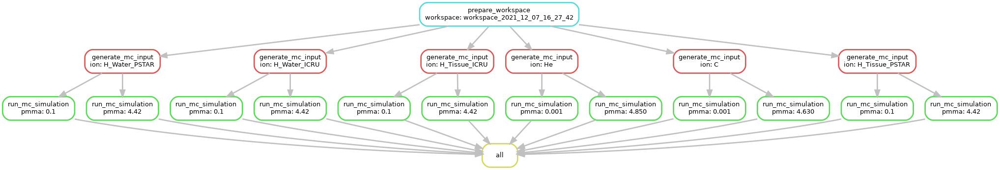

# How to use?

1. write_thickness.py calculates how thick the range shifter material is for a given setup. This is done by first fitting cubic splines to simulated data, where LET vs range shifter thickness has been plotted, and then use these splines as a lookup table for the desired LET we want to calculate.
   
2. This data is being added to the config.cfg file under src

3. Preparation of Monte-Carlo simulation input, running (in some cases parallel) simulation code SHIELD-HIT12A 
   and results collection is governed by Snakemake software. The workflow is defined in `Snakemake` file. 
   The same Snakemake workflow can be executed either locally or in cluster environment (i.e. submitted as jobs to batch system).
   To execute locally type:   

```shell
cd 2015_Guan
./run_local.sh
```

or equivalent (for 1000 primaries and MC simulation time 1 minut, with only 2 PMMA samples per ion, on 4 threads)

```shell
TIMEPATTERN=$( date +%Y_%m_%d_%H_%M_%S ) snakemake --config nprim=1000 stop_time=00:01:00 pmma_samples=2 -j4
```

Note that you can specify number of primary particles to be simulated (`nprim`) and number of parallel local jobs (`-j`)

To run the same simulation on a cluster:

```shell
./run_slurm_plgrid.sh
```

or equivalent:
```shell
TIMEPATTERN=$( date +%Y_%m_%d_%H_%M_%S ) PATH=$PATH:$SCRATCH/shieldhit snakemake --config nprim=10000 --notemp --cluster-config plgrid_cluster_conf.yaml --immediate-submit --cluster './submit_snake_slurm.py {dependencies}' -j 5000
```

The number of parallel tasks for MC simulation step is defined in the cluster config file `plgrid_cluster_conf.yaml`

The results are typically saved under directory like `workspace_2021_05_18_15_49_12`.

5. Now we can use collect_data_mult.py under src/, to collect all generated data from the output of the MC-sims. 

(The final fit of the data is done elsewhere)

# Debugging

## Generate Snakefile DAG graph

```shell
TIMEPATTERN=$( date +%Y_%m_%d_%H_%M_%S ) snakemake --config pmma_samples=2 --dag | dot -Tpng > dag.png
```


